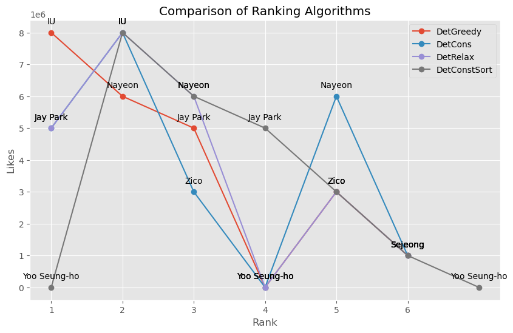

# Fair Re-ranking
This Repo is inspired from the paper ["Fairness-Aware Ranking in Search & Recommendation Systems with Application to LinkedIn Talent Search"](https://dl.acm.org/doi/10.1145/3292500.3330691)


## Introduction

Ranked lists generated by recommendation systems have been becoming computationally efficient, yet there is a growing need to ensure they are free from algorithmic bias. Such biased results can lead to systematic discrimination, reduce visibility, cause over/under representation and be the reason for gender and other forms of bias. In the current implementation, such bias is quantified and mitigated via fairness-aware re-ranking algorithms. For a given search query, these algorithms can generate a desired distribution (over protected attribute(s)) of top ranked results, thereby maintaining demographic parity or equal opportunity as per requirement. Metrics are defined to assess the fairness thus achieved and results over a synthetically generated data are shown.

### Algorithms implemented:

#### `DetGreedy(data, p, k_max)`:
   - This algorithm implements the Deterministic Greedy approach for ranking attributes.
   - It takes in the `data` dictionary, probability distribution `p`, and the maximum number of iterations `k_max`.
   - It initializes an empty list `rankedAttList` to store the ranked attributes and an empty list `rankedScoreList` to store their corresponding scores.
   - It also initializes a dictionary `counts` to keep track of the count of each attribute.
   - For each iteration `k` from 1 to `k_max`, it determines the set of attributes `belowMin` that are below their minimum expected count and the set of attributes `belowMax` that are between their minimum and maximum expected counts.
   - If `belowMin` is not empty, it selects the attribute with the maximum score from `belowMin`. Otherwise, it selects the attribute with the maximum score from `belowMax`.
   - The selected attribute and its score are appended to `rankedAttList` and `rankedScoreList`, respectively, and the count of the selected attribute is incremented in `counts`.
   - Finally, it returns a pandas DataFrame with the ranked attributes and their scores.

#### `DetCons(data, p, kmax)`:
   - This algorithm implements the Deterministic Consensus approach for ranking attributes.
   - It follows a similar structure to `DetGreedy` but with a different attribute selection criterion.
   - If `belowMin` is not empty, it selects the attribute with the maximum score from `belowMin`.
   - If `belowMin` is empty, it calculates a score for each attribute in `belowMax` based on the ratio of the ceiling of the expected count to the probability of the attribute. It selects the attribute with the minimum score.
   - The selected attribute and its score are appended to `rankedAttrList` and `rankedScoreList`, respectively, and the count of the selected attribute is incremented in `counts`.
   - Finally, it returns a pandas DataFrame with the ranked attributes and their scores.

#### `DetRelax(data, p, kmax)`:
   - This algorithm implements the Deterministic Relax approach for ranking attributes.
   - It follows a similar structure to `DetGreedy` and `DetCons` but with a different attribute selection criterion when `belowMin` is empty.
   - If `belowMin` is empty, it calculates a score for each attribute in `belowMax` based on the ceiling of the ratio of the ceiling of the expected count to the probability of the attribute.
   - It determines the minimum score among the calculated scores and selects the attribute with the maximum score from the attributes that have the minimum score.
   - The selected attribute and its score are appended to `rankedAttrList` and `rankedScoreList`, respectively, and the count of the selected attribute is incremented in `counts`.
   - Finally, it returns a pandas DataFrame with the ranked attributes and their scores.

#### `DetConstSort(data, p, kmax)`:
   - This algorithm implements the Deterministic Constant Sort approach for ranking attributes.
   - It initializes dictionaries `rankedAttrDict`, `rankedScoreDict`, and `maxIndicesDict` to store the ranked attributes, their scores, and their maximum indices, respectively.
   - It also initializes dictionaries `counts`, `minCounts`, and `tempMinCounts` to keep track of the count, minimum count, and temporary minimum count of each attribute.
   - It iterates until all attributes are ranked up to `kmax`.
   - For each iteration `k`, it updates the temporary minimum counts based on the probability distribution.
   - It determines the set of attributes `changedMins` whose minimum counts have changed.
   - If `changedMins` is not empty, it selects the attributes from `changedMins` based on their scores in descending order.
   - For each selected attribute, it updates the `rankedAttrDict`, `rankedScoreDict`, and `maxIndicesDict`, and performs a sorting operation to maintain the correct order based on the scores and maximum indices.
   - Finally, it returns a pandas DataFrame with the ranked attributes and their scores.

## Getting Started 

The ipynb gives a fine overview of the paper and structurally presents the code for easy understanding.

## Project Organization
    ├── README.md                        <- Project Homepage
    |── FairRanking.ipynb
    |── Results                          <- Sub directory to store the results
    ├── requirements.txt                 <- Python Dependencie Required to run the repo    
    ├── experiment.py                    <- The Simulation Framework 
    ├── fair_algorithms.py               <- The fair algorithms mentioned in the paper
    ├── metrics.py                       <- The set of metrics to evaluate bias
    ├── plot_utils.py                    <- Utilities for plotting the results
    ├── utils.py                         <- Some utility functions
    ├── main.py                          <- The final executable to run the simulations
    |── dataset.ipynb                    <- Results with dataset

## Results
| id | name         | gender | age | genres                | likes   | newcomer |
|----|--------------|--------|-----|-----------------------|---------|----------|
| 1  | Jay Park     | M      | 35  | Hip hop, R&B          | 5000000 | False    |
| 2  | IU           | F      | 28  | K-pop, Folk           | 8000000 | False    |
| 3  | Zico         | M      | 29  | Hip hop, Rap          | 3000000 | False    |
| 4  | Nayeon       | F      | 26  | K-pop, Dance          | 6000000 | False    |
| 5  | Sejeong      | F      | 25  | K-pop, Ballad         | 1000000 | False    |
| 6  | Yoo Seung-ho | M      | 22  | Ballad, Folk          | 0       | True     |

This table provides a clear, structured view of your dataset, making it easy to read and understand the attributes associated with each individual.



## Prerequisites

Once you clone the repository, please run 

```console
pip install -r requirements.txt
```

to make sure you have all the dependencies available to run the codes.

## Executing The Code

Then open your console from the same path location and run the following 

```console
python ./main.py
```
